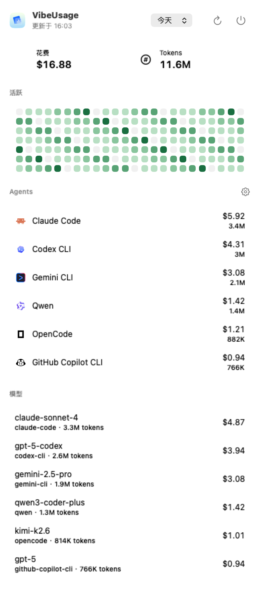
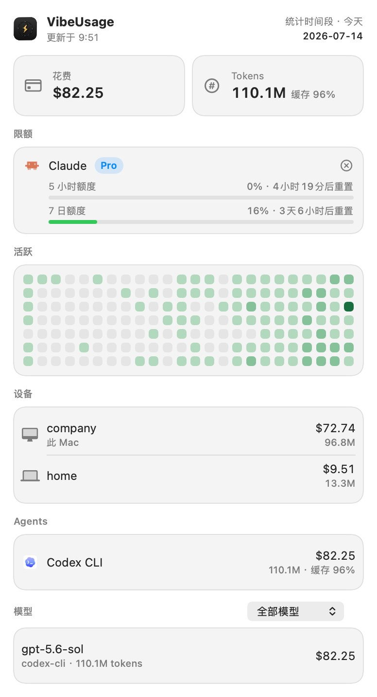

# VibeUsage

VibeUsage 是一个 macOS 菜单栏应用，用来从本机各种 AI 编程助手的日志中统计 token 用量和估算成本。它会扫描本地会话文件，归一化不同工具的用量字段，写入本机 SQLite 缓存，并在菜单栏里展示当天、昨天、本周、本月的总花费、token、来源和模型拆分。

项目的目标不是替代官方账单，而是给日常使用 AI coding agent 的人一个轻量、本机优先的视图：本地用量统计的数据从本机日志读取、聚合在本机完成；订阅额度监控是可选功能，由用户在应用内主动点击"连接"后才联网——Codex 走独立 OAuth 授权、令牌由 VibeUsage 自己持有，Claude 则复用 Claude Code 本机已登录的令牌（只读，因为 Anthropic 已从服务端禁止第三方自建 Claude OAuth）。整块功能可以随时断开或在设置中完全关闭联网。



上图使用真实 SwiftUI 菜单栏界面渲染 mock 数据，用来展示数据量较饱满时的统计视图。

用量控制台里还可以把统计数据一键导出成分享海报（保存图片 / 拷贝图片 / 系统分享）：



## 功能

- macOS 菜单栏窗口，快速查看 spend、tokens、agents、models。
- 订阅额度监控（可选）：在菜单栏或控制台点击"连接 Claude / Codex 账号"，走各自官方 OAuth 授权流程后，显示 Claude Code（5 小时会话 / 7 天总量 / 7 天 Opus / 7 天 Sonnet）和 Codex/ChatGPT（当前会话 / 每周额度）的剩余额度和重置倒计时；可随时断开连接，或在设置中整体关闭（默认开启）。
- 支持按今天、昨天、本周、本月筛选。
- 支持隐藏/显示已发现的 agent 来源。
- 独立的用量控制台窗口：趋势图（按天、按来源堆叠 spend/tokens）、项目维度和模型维度拆分，支持近 7/30/90 天和本月切换，并可导出/分享统计图片。
- 菜单栏图标旁可选显示今日花费，随时可在显示设置里关闭。
- 将不同来源统一为 `UsageEvent`，包含输入、输出、缓存写入、缓存读取、reasoning token、模型、会话、项目和成本。
- 使用 GRDB + SQLite 做本地缓存，保存增量解析 checkpoint，避免每次全量重扫。
- 内置模型价格快照，按模型 family 估算 USD 成本。
- 启动时自动检查 GitHub Releases，有新版本时提示下载 DMG。
- 自动刷新：FSEvents 监听 agent 日志目录，并在 5 分钟周期内做兜底 rescan。
- 适配器架构清晰，新增来源时只需要实现 `UsageSourceAdapter` 并注册。

## 支持的数据源

当前内置适配器覆盖：

- Claude Code
- Codex CLI
- OpenCode
- Amp
- Droid
- Hermes Agent
- pi-agent
- Goose
- OpenClaw
- Kilo
- Kimi
- Qwen
- GitHub Copilot CLI
- Gemini CLI

不同工具的日志格式差异很大。VibeUsage 为每个来源提供独立适配器，按各自日志结构解析 timestamp、model、session、request、usage 和 cost，避免跨 agent 猜测字段。

## 与 ccusage 的关系

VibeUsage 的用量统计思路参考了 [ccusage/ccusage](https://github.com/ccusage/ccusage) 的实现，参考版本为 `cdda1821cf8a130c4d92cfd5aec101dfba96e1c9`。本项目没有复制或 vendoring ccusage 源码，而是将其中成熟的数据处理逻辑改写成 Swift/macOS 应用形态。

主要参考点包括：

- 从本机 agent CLI 日志读取用量，而不是依赖远端账单 API。
- 为不同 agent 建立独立 adapter：负责发现文件、解析日志、提取会话/项目/模型信息。
- 将来源差异归一化为统一 token 结构：input、output、cache creation、cache read，以及 Codex 的 reasoning token。
- 处理 Claude Code 的 `costUSD`：日志自带成本时优先使用，否则按模型价格估算。
- 处理 Codex token_count：支持 `last_token_usage`，也支持从累计 `total_token_usage` 中计算增量。
- 做模型 family 归一化，例如去掉 Claude 模型名末尾的日期后缀，再用归一化后的 key 查价格。
- 按去重 key 做幂等写入；冲突时优先保留非 sidechain replay，或保留 token 总量更大的记录。
- 使用 LiteLLM 社区价格数据作为价格表来源，并将快照打包进应用。

ccusage 是 CLI 报表工具，擅长直接生成 daily、weekly、monthly、session、blocks 等终端报表；VibeUsage 则把类似的解析和聚合逻辑放到本机常驻的菜单栏应用里，重点是后台增量扫描、本机缓存和随手查看。

## 架构

代码按 SwiftPM target 拆分：

- `VibeUsageCore`：核心模型、协议、adapter registry、价格协议。
- `VibeUsagePricing`：内置价格快照、模型别名解析、价格查询。
- `VibeUsageStorage`：SQLite schema、GRDB 存储、去重和聚合查询。
- `VibeUsageWatching`：扫描所有 adapter，按文件 checkpoint 增量解析。
- `VibeUsageAggregation`：把存储层数据聚合成 UI 使用的 dashboard snapshot。
- `VibeUsageAdapter`：Claude Code、Codex CLI，以及其他 agent 的独立适配器实现。
- `VibeUsageQuota`：订阅额度监控子系统，独立于上面的本地用量统计管线（不依赖 GRDB/Storage）：驱动 OAuth 授权/刷新流程、把 VibeUsage 自己的访问令牌存进独立的钥匙串项、调用官方额度接口、解析成 UI 用的 quota snapshot。
- `VibeUsageUI`：SwiftUI 菜单栏和 dashboard 视图，包含独立的 Dashboard 控制台窗口（趋势图、项目、会话列表）。
- `VibeUsageApp`：应用入口和依赖装配。

数据流（本地用量统计）：

```text
Agent logs
  -> UsageSourceAdapter
  -> UsageIngestor
  -> GRDBUsageEventStore
  -> UsageAggregationService
  -> SwiftUI menu bar
```

数据流（订阅额度监控，完全独立的实时子系统）：

```text
用户在应用内点击"连接"
  -> QuotaConnectionManager（OAuth 授权/刷新，VibeUsage 自己的钥匙串）
  -> ClaudeQuotaProvider / CodexQuotaProvider
  -> QuotaService
  -> SwiftUI menu bar / dashboard
```

## 本地数据位置

VibeUsage 默认会把本地缓存写到：

```text
~/Library/Application Support/VibeUsage/usage.sqlite
```

各 agent 的源日志仍保留在它们自己的默认目录中。部分适配器支持环境变量覆盖：

| 环境变量 | 默认路径 / 说明 |
|----------|-----------------|
| `CLAUDE_CONFIG_DIR` | Claude Code 配置目录 |
| `CODEX_HOME` | Codex CLI 数据目录 |
| `OPENCODE_DATA_DIR` | OpenCode 数据目录 |
| `AMP_DATA_DIR` | Amp 数据目录 |
| `GEMINI_DATA_DIR` | Gemini CLI 数据目录 |
| `KIMI_DATA_DIR` | Kimi 数据目录 |
| `QWEN_DATA_DIR` | Qwen 数据目录 |
| `KILO_DATA_DIR` | Kilo 数据目录 |
| `HERMES_HOME` | Hermes Agent 目录 |

## 自动刷新

应用启动后会：

1. 立即执行一次 ingest scan。
2. 通过 FSEvents 监听已发现 adapter 的日志根目录；目录变化会在约 2 秒 debounce 后触发 rescan。
3. 每 5 分钟执行一次兜底 rescan，防止漏掉文件系统事件。

如果 FSEvents 初始化失败，应用会记录日志并继续依赖定时 rescan。

## 额度监控数据来源

订阅额度监控是一个独立于本地用量统计的实时子系统（不写入 SQLite）。两家来源的连接机制不同，原因是 Anthropic 自 2026-01 起在服务端强制"消费级订阅的 OAuth token 只能由 Claude Code / Claude.ai 使用"，第三方应用无法自己走 OAuth 签发 Claude token（会 403）——所以 Claude 只能像 CodexBar 一样复用 Claude Code 已签发的 token，而 Codex/ChatGPT 不受此限制、仍可自建 OAuth：

| 来源 | 连接方式 | 令牌来源 | 额度接口 |
|------|----------|----------|----------|
| Claude | 点击"连接 Claude 账号"，复用 Claude Code 本机已登录的 token（只读，过期时用其 refreshToken 刷新，从不写回 Claude Code 的存储） | 读取钥匙串条目 `Claude Code-credentials`，回退 `~/.claude/.credentials.json` | `GET https://api.anthropic.com/api/oauth/usage` |
| Codex / ChatGPT | 点击"连接 Codex 账号"，浏览器 OAuth 授权、本地回调（`localhost:1455`）自动完成 | VibeUsage 自建并持有的令牌，存于专属钥匙串条目 `VibeUsage-connected-accounts` | `GET https://chatgpt.com/backend-api/wham/usage` |

Claude 侧需要本机已安装并登录 Claude Code（否则连接时提示"未检测到 Claude Code 登录"）；Codex 侧复用的是 Codex CLI 官方客户端公开的 OAuth client id（OpenAI 未开放第三方独立注册），但授权同意与令牌签发/刷新都是 VibeUsage 自己发起和持有的。未连接时显示"未连接"和"连接"按钮；令牌失效时提示"登录已过期，请重新连接"；随时可断开清除本地令牌。可以在设置里关闭"监控订阅额度（联网）"，完全禁用这部分网络请求。

## macOS 提示应用已损坏

如果从 GitHub Release 下载 DMG 后，macOS 提示“VibeUsage 已损坏，无法打开”或要求移到废纸篓，通常是因为当前 release 使用 ad-hoc 签名，没有经过 Apple notarization，系统给下载的 `.app` 加上了 quarantine 标记。

把应用拖到“应用程序”目录后，可以在终端执行：

```bash
sudo xattr -dr com.apple.quarantine /Applications/VibeUsage.app
```

然后重新打开 VibeUsage。如果你放在其他目录，把命令中的 `/Applications/VibeUsage.app` 替换为实际路径即可。

## 开发

要求：

- Swift 6.2
- macOS 26 SDK

运行测试：

```bash
swift test
# 或
make test
```

重新编译并重启本地应用：

```bash
Scripts/rebuild-and-restart.sh
# 或
make restart
```

生成菜单栏预览图：

```bash
Scripts/regenerate-preview.sh
# 或
make preview
```

构建可执行文件：

```bash
swift build
```

打包成本机 `.app`：

```bash
Scripts/build-app.sh release
open .build/VibeUsage.app
```

打包 DMG：

```bash
VERSION=0.1.0 BUILD_NUMBER=1 Scripts/package-dmg.sh release
open .build/VibeUsage-0.1.0.dmg
```

更新模型价格快照：

```bash
python3 Scripts/update-pricing.py
```

价格快照会写入 `Sources/VibeUsagePricing/Resources/model_prices.json`，并在构建时随应用一起打包。

更多贡献说明见 [CONTRIBUTING.md](CONTRIBUTING.md)。

## 发布

仓库包含 GitHub Actions workflow：

- `CI`：在 push / pull request 时运行 `swift test`；`main` 分支 push 后会尝试自动更新 `docs/usage-preview.png`。
- `Release`：推送 `v*` tag 后构建 DMG 并创建 GitHub Release。

```bash
git tag v0.1.0
git push origin v0.1.0
```

发布产物命名为：

```text
VibeUsage-0.1.0.dmg
```

workflow 会把 tag 中的版本号写入 `CFBundleShortVersionString`，把 GitHub Actions run number 写入 `CFBundleVersion`。当前脚本默认使用 ad-hoc codesign，下载后 macOS 可能提示开发者身份未验证；如果要正式分发，可以在 CI 中配置 `SIGN_IDENTITY` 仓库 secret，或在本地执行：

```bash
SIGN_IDENTITY="Developer ID Application: Your Name (TEAMID)" Scripts/build-app.sh release
```

## 自动更新检查

VibeUsage 启动时会请求：

```text
https://api.github.com/repos/tyuan511/vibe-usage/releases/latest
```

如果 latest release 的 tag 版本号高于当前应用的 `CFBundleShortVersionString`，会弹出更新提示，并优先打开 release 里的 `.dmg` 下载链接；如果 release 没有 DMG 附件，则打开 release 页面。应用不会自动替换本地 `.app`，更新安装仍由用户确认完成。

## 说明

VibeUsage 的成本结果是基于本地日志和内置价格快照的估算，可能与服务商最终账单存在差异。日志缺少模型、价格表缺少模型，或不同 agent 对 token 字段定义不一致时，应用会尽量保留用量并标记成本为估算。
